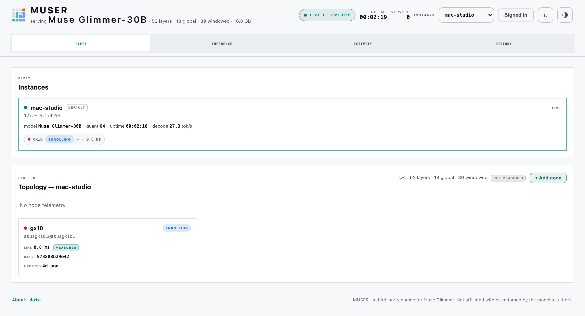

# muser-console

A secure, responsive dashboard for one or more [muser](https://github.com/High-Performance-AI-Lab/muser)
engines. Run it beside an engine, open it from the same computer, or serve it
over HTTPS on a private network and pair an iPhone with a one-time QR code.

For the shipped one-Mac + one-GX10 path, this repository is optional: the
`muser` binary already embeds the local dashboard and its Add Node flow. Run
`muser up`, add the node without a separate loopback login, and keep that
process running: the same listener loads the Mac decoder and becomes the
inference server when setup passes. Install muser-console when you need a
multi-engine fleet view, retained history, or private-network phone access.

muser-console shows live engine telemetry, fleet health, cache behavior,
sessions, events, and rolling history. It never turns missing measurements
into zeroes or demo data: unavailable data stays visibly unavailable.



*A live capture: one Mac engine mid-decode, a prefill node enrolling, and
measurements labeled for exactly what they are — values nothing reported
show a dash, never a zero.*

## Watch the workflow

https://github.com/user-attachments/assets/02b6e368-fe46-4167-a7f0-1380e0ce2a47

The main `muser` binary embeds the same dashboard surface maintained here.
This is a real, privacy-masked capture; accelerated sections are labeled on
screen, while the final answer and telemetry are shown in real time. The
source-controlled [H.264 MP4](https://github.com/High-Performance-AI-Lab/muser/blob/main/docs/assets/muser-onboarding-and-remote-prefill.mp4)
is also available for download.

## What you get

- **Fleet:** engine instances, topology, prefill nodes, and optional hardware
  exporters.
- **Inference:** a live prompt surface, disaggregation, measured cache
  savings, KV layer behavior, and speculative-decoding counters.
- **Activity:** live serving rates, transfers, sessions, and current events.
- **History:** one-second sampling with gap-preserving charts.
- **Secure remote access:** HTTPS sessions for laptops and phones, including
  local-network QR pairing without putting an API key in the QR code.

### Cold producer startup stays visible

When **Add node** must start a cold native producer, the producer row expands
to show five real vLLM milestones: engine setup, weight loading, 8K chunk
initialization, 128K KV allocation, and the first-request warmup. The active
segment is animated, carries an elapsed clock, and receives a sanitized
heartbeat every 15 seconds. It is intentionally not a smooth time percentage:
vLLM does not expose an honest fractional percentage for each operation. The
console never relays raw container logs to the browser.

With artifacts already present, final cold receipts reached ready in 187–206
seconds; the qualified 187-second run finished weights at 108 seconds, began
KV/kernel warmup at 115, and began first-request warmup at 153. A matching healthy producer remains
warm when it is re-added. The qualified chunked-prefill connector preserves
the 131K contract while vLLM initializes an 8K scheduler shape. The remaining
weight load, CUDA engine initialization, KV allocation, and real warmup cannot
be disabled while leaving the same ready engine. Details are documented in the
[muser quickstart](https://github.com/High-Performance-AI-Lab/muser#quickstart).

The dashboard has no CDN, JavaScript package, or frontend build step. The
server is a single Rust binary and the UI is the checked-in
[`ui/muser-dashboard.html`](ui/muser-dashboard.html) file.

## Quick start: one engine on the same machine

This is the shortest path to a working console at
`http://127.0.0.1:5959/`.

### 1. Before you start

You need:

- a running muser engine with its telemetry routes enabled;
- the file passed to that engine's `--api-key-file` option; and
- a Rust installation. This repository pins Rust 1.93.1 in
  [`rust-toolchain.toml`](rust-toolchain.toml), so `cargo` selects the right
  toolchain automatically.

The examples below assume the engine is listening on `127.0.0.1:4949`.
Change that port if your engine uses another one.

### 2. Build the console

From the repository root:

```sh
cargo build --release --locked --bin muser-console
```

The binary is written to `target/release/muser-console`.

### 3. Create a console access key

The console has its own key. It is deliberately different from every engine
key.

```sh
mkdir -p "$HOME/.config/muser-console" "$HOME/.local/share/muser-console"
chmod 700 "$HOME/.config/muser-console"
openssl rand -hex 32 > "$HOME/.config/muser-console/console.key"
chmod 600 "$HOME/.config/muser-console/console.key"
```

Keep this key private. It authorizes both telemetry and management actions.

### 4. Create `config.toml`

Save the following as `~/.config/muser-console/config.toml`. Replace every
`/absolute/path/to/...` entry with a real absolute path. TOML paths do not
expand `~` or shell variables.

```toml
listen = "127.0.0.1:5959"
access_key_file = "console.key"
ui_dir = "/absolute/path/to/muser-console/ui"

[history]
enabled = true
db_path = "/absolute/path/to/muser-console-data/history.sqlite"
retention_days = 7

[[instance]]
name = "local"
base_url = "http://127.0.0.1:4949"
api_key_file = "/absolute/path/to/muser/engine.key"
```

`api_key_file` must point to the same key file used by that muser engine. Key
files must be regular, non-symlink files with mode `0600` or stricter.

### 5. Start and sign in

```sh
./target/release/muser-console \
  --config "$HOME/.config/muser-console/config.toml"
```

Open <http://127.0.0.1:5959/>, choose **Sign in**, and paste the contents of
`console.key`. On macOS, this copies it without printing it in the terminal:

```sh
pbcopy < "$HOME/.config/muser-console/console.key"
```

The first configured `[[instance]]` is selected by default. Stop the console
with `Ctrl-C`.

## Repository skill

Operational assistants can follow
[`muser-console-up`](skills/muser-console-up/SKILL.md) to decide whether the
standalone service is needed, configure it without exposing credentials, and
prove both console health and a real engine-backed prompt.

## Open the console from another computer

muser-console can be reached from other computers on your network. When it's
listening on a network address (not just this machine), it requires HTTPS — it
won't start on a network address over plain HTTP.

| Mode | `listen` | Browser URL | Login |
|---|---|---|---|
| This computer only | `127.0.0.1:5959` | `http://127.0.0.1:5959/` | Access key held in page memory; QR pairing unavailable |
| LAN or private VPN | Private IP or `0.0.0.0:5959` | Certified `https://` hostname or IP | Secure session; one-time QR pairing available |

Use a certificate whose Subject Alternative Name covers the exact hostname or
IP you will type into the browser. The simplest topology is:

```text
iPhone or laptop  -- HTTPS -->  muser-console  -- loopback HTTP -->  muser
```

The engine can remain bound to loopback. Only the console needs to be visible
on the private network.

### Create a trusted LAN certificate on macOS

If you already have a certificate from a trusted internal CA, use it and skip
this section. For a small private network,
[`mkcert`](https://github.com/FiloSottile/mkcert) provides a convenient local
CA:

```sh
brew install mkcert
mkcert -install
```

Find the Mac's LocalHostName with `scutil --get LocalHostName` and its LAN IP
in System Settings → Network. The following example assumes
`muser-mac.local` and `192.0.2.50`; replace both with the names your devices
actually use:

```sh
mkcert \
  -cert-file "$HOME/.config/muser-console/console.pem" \
  -key-file "$HOME/.config/muser-console/console-key.pem" \
  muser-mac.local 192.0.2.50
chmod 600 "$HOME/.config/muser-console/console-key.pem"
```

Never copy or share mkcert's `rootCA-key.pem`. It is the private key for the
local CA, not a client certificate.

### Enable the HTTPS listener

Change the top of `config.toml` to:

```toml
listen = "0.0.0.0:5959"
tls_cert = "console.pem"
tls_key = "console-key.pem"
access_key_file = "console.key"
ui_dir = "/absolute/path/to/muser-console/ui"
```

Use a specific address such as `192.0.2.50:5959` instead of `0.0.0.0:5959`
when you want to restrict the listener to one interface. The TLS private key
must be a regular, non-symlink file with exact mode `0600`.

Restart muser-console and visit the exact certified address, for example:

```text
https://muser-mac.local:5959/
```

Do not continue through a certificate warning. Fix the hostname, certificate,
or trust setup first. Also allow inbound TCP port `5959` in the host firewall
for the private network only.

## Pair an iPhone with the QR code

The QR login is available after the console is running on a non-loopback HTTPS
listener. It is intentionally unavailable in loopback HTTP mode.

### One-time iPhone trust setup

An iPhone must trust the CA before it can open the pairing URL. For mkcert:

1. Run `mkcert -CAROOT` on the Mac and locate **`rootCA.pem`**.
2. AirDrop only `rootCA.pem` to the iPhone. Never transfer
   `rootCA-key.pem`.
3. On the iPhone, install the downloaded profile.
4. Open **Settings → General → About → Certificate Trust Settings** and
   enable full trust for that root certificate. Apple documents this step in
   [Trust manually installed certificate profiles](https://support.apple.com/102390).
5. Open the console's exact HTTPS URL in Safari and confirm there is no
   certificate warning.

This trust step is separate from login. The QR code cannot and must not bypass
TLS certificate validation.

### Pair the phone

1. On a trusted laptop or desktop, open the same HTTPS console URL and sign in
   with `console.key`.
2. Choose **Pair device** in the header.
3. Confirm the displayed address and choose **Generate QR**.
4. Scan the QR with the iPhone Camera app and open the link.

The QR contains a random, one-use pairing credential—not the console key. It
expires after two minutes, is bound to the exact HTTPS origin, and can be
redeemed only from a directly connected local/private peer. Successful pairing
creates a one-hour Secure, HttpOnly session on the phone. The token disappears
from the address bar before the page makes a network request.

If a code will not be scanned, choose **Revoke**. A used, expired, or revoked
code cannot be reused.

### If **Pair device** is missing

Check all four conditions:

- the console is listening on a non-loopback address;
- both `tls_cert` and `tls_key` are configured;
- the browser URL starts with `https://`; and
- the desktop browser is signed in.

If the iPhone opens the page but pairing fails, check that it is on the same
private network, that it trusts the certificate, and that the code is less
than two minutes old.

## Access over a private VPN

Bind the console to the private VPN interface (or firewall the listener to
that interface), issue a certificate for the VPN hostname, and use the same
HTTPS setup. QR redemption accepts direct private, link-local, ULA, and CGNAT
peers; it rejects public source addresses and ignores forwarded-client-IP
headers.

Do not port-forward muser-console directly to the public Internet. It holds
engine management credentials and should live behind a trusted LAN, host
firewall, or private VPN.

## Add more engines

Add one `[[instance]]` table per engine. The first entry is the default.
Plaintext upstreams are allowed only for literal loopback IPs; a remote engine
must use HTTPS with a certificate valid for its hostname:

```toml
[[instance]]
name = "gx10"
base_url = "https://gx10.local:4949"
api_key_file = "gx10-engine.key"
ca_file = "lab-ca.pem"
```

Omit `ca_file` when the engine certificate chains to a platform-trusted root.
Each engine gets its own TLS trust store, so a custom CA configured for one
instance cannot authorize another.

The complete two-engine, two-exporter example is
[`examples/config.toml`](examples/config.toml).

## Optional hardware exporters

The engine does not report native host power or NVIDIA GPU telemetry. Optional
sidecars add those measurements without inventing values:

- [`agents/mac-exporter`](agents/mac-exporter) reads macOS `powermetrics`;
- [`agents/gx10-exporter`](agents/gx10-exporter) reads NVIDIA NVML on GX10.

Attach an exporter to an instance with an `[[agent]]` table:

```toml
[[agent]]
name = "mac-power"
base_url = "http://127.0.0.1:9708"
instance = "local"
kind = "mac"
```

Exporter deployment, privileges, upgrade, and rollback are covered in
[`docs/agent-deployment.md`](docs/agent-deployment.md).

## Configuration notes

- Relative file paths are resolved from the directory containing
  `config.toml`, not from the process working directory.
- History is enabled by default, samples once per second, and retains seven
  days unless configured otherwise.
- The console access key is used only between the browser and console. Engine
  keys stay server-side and are injected only for their own engine.
- On HTTPS, login creates a one-hour Secure/HttpOnly/SameSite=Strict session.
  Management requests are CSRF-protected, and WebSockets use short-lived,
  single-use tickets.
- A failed engine affects only its own instance. Other instances and their
  existing streams continue independently.
- Missing telemetry remains unavailable. History charts preserve real gaps
  instead of connecting or zero-filling them.

## Troubleshooting

**The server says `tls_cert and tls_key are required`.** A non-loopback
`listen` address always requires both files. Use loopback HTTP for local-only
access or configure HTTPS for network access.

**The server rejects a key file's permissions.** Run `chmod 600 FILE`. TLS
private keys require exact `0600`; access and engine key files allow `0600` or
stricter. Symlinks are not accepted.

**A remote engine URL is rejected.** `http://` upstreams must use a literal
loopback IP such as `127.0.0.1`. Configure HTTPS and a valid SAN for every
non-loopback engine.

**The dashboard shows an instance as disconnected.** Check the engine's
`/healthz`, confirm `base_url`, and make sure `api_key_file` contains the key
used by that engine.

**The dashboard page cannot be found.** `ui_dir` must point to the directory
that contains `muser-dashboard.html`, not to the HTML file itself.

**Safari reports an untrusted certificate.** Install only the issuing root CA
certificate on the iPhone, enable full trust in Certificate Trust Settings,
and make sure the browser hostname appears in the server certificate's SANs.

## Development and verification

The locked workspace gate requires no root privileges or hardware:

```sh
cargo fmt --all --check
cargo test --workspace --all-targets --locked
cargo clippy --workspace --all-targets --locked -- -D warnings
cargo build --workspace --release --locked
```

Useful technical references:

- [Console API, authentication, TLS, and routing](docs/console-api.md)
- [Engine telemetry contract](docs/engine-contract.md)
- [Agent deployment](docs/agent-deployment.md)
- [OpenTelemetry collector](docs/otel-collector.md)

## License

muser-console is available under either Apache-2.0 or MIT, at your option.
The full texts are in [`LICENSE-APACHE`](LICENSE-APACHE) and
[`LICENSE-MIT`](LICENSE-MIT). [`NOTICE`](NOTICE) records the third-party
material this repository carries and the terms that came with it.
